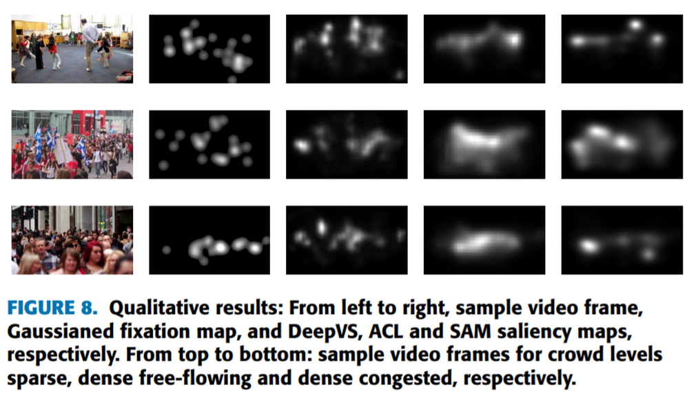

CrowdFix
=========

Detail of the dataset and its analysis can be found in our IEEE Access paper [here](https://ieeexplore.ieee.org/document/8918032). This dataset is part of the **MIT/Tübingen Saliency Benchmark datasets**, whose detail can be found [here](https://saliency.tuebingen.ai/datasets.html)

Here is a demo video for an overview of the dataset:

<a href="/figs/demo.mp4" title="Eyetracking Demo"></a>

## Brief introduction
CrowdFix includes **434 videos** with diverse crowd scenes, containing a total of **37,493 frames** and **1,249 seconds**. The diverse content refers to different crowd activities under three distinct categories - Sparse, Dense Free Flowing and Dense Congested. All videos are at 720p resolution and 30 Hz frame rate. For monitoring the eye movements, an EyeTribe eye tracker  was used in our experiment. **26 participants** (10 males and 16 females), aging from 17 to 40, participated in the eye-tracking experiment. All participants were non-experts for the eye-tracking experiment, with normal/corrected-to-normal vision. During the experiment, the distance between subjects and the monitor was fixed at 60 cm. Before viewing videos, each subject was required to perform a 9-point calibration for the eye tracker. After the calibration, the subjects were asked to free-view videos displayed in an MTV style. Finally,  fixations of all 32 subjects on 538 videos were collected for our eye-tracking database.

Some stills from the dataset videos are shown below: 


A sample of resultant heatmaps of eye fixations over a few videos are shown below: 

<a href="/figs/saliency_heatmaps.mp4" title="Sample Heatmaps"></a>

## How to use 
The dataset can be downloaded from the following [link](https://drive.google.com/drive/folders/1_7wKveiebIe16opBnIOMrRJzxASo9o4L?usp=sharing).

<pre> CrowdFix
  ┬ videos: 434 clips annotated with their category, 5GB 
  ├ frames.py: Run frame.py without modifying folder hierarchy to generate the frames with the same name sequence as the corresponding ground truth binary fixation and saliency maps.
  ├ Binary Fixation Maps
  └ Saliency Maps
</pre> 

              
**'CategoryInfo.xlsx'** lists the information of crowd categories against each video. It includes the following information:
* 'column 1' : Video Number as given in the uploaded video folder.
* 'column 2' : Crowd Category Type (SP for Sparse, DF for Dense Free-Flowing and DC for Dense Congested)

<!-- ## For creating a test set, reading binary and fixation maps in python, and manipulating direcotries to use with any training code:
Please see this folder for [**demo code**](demo_code).
-->

## Evaluation of a Deep Learning Model for Predict Visual Saliency on CrowdFix:

Please have a look at this repo [here](https://github.com/MemoonaTahira/Visual-Saliency-Metrics-for-Evaluating-Deep-Learning-Model-performance), which has codes to easily add any Visual Saliency dataset (image/video), including CrowdFix, and use a test set to evaluate any given model's performance for predicting visual saliency.  


Some saliency prediction results on DeepVS, ACL and SAM against a baseline of gaussianed fixation maps:


Some of the other most popular Deep Learning video saliency prediction models can be found in this leaderboard [here](https://mmcheng.net/videosal/).

## Citation
You are welcome to freely use this database, and please cite with the following Bibtex code:

```
@ARTICLE{8918032,
author={M. {Tahira} and S. {Mehboob} and A. U. {Rahman} and O. {Arif}},
journal={IEEE Access},
title={CrowdFix: An Eyetracking Dataset of Real Life Crowd Videos},
year={2019},
volume={7},
pages={179002-179009},
keywords={Videos;Visualization;Computational modeling;Gaze tracking;Predictive models;Meters;Licenses;Attention;crowd analysis;crowd videos;eye movement;eye tracking;fixations;region of interest;saliency},
doi={10.1109/ACCESS.2019.2956840},
ISSN={2169-3536},}
```

Feel free to contact mtahira.mscs17seecs@seecs.edu.pk / smehboob.mscs17seecs@seecs.edu.pk in case of any queries.


